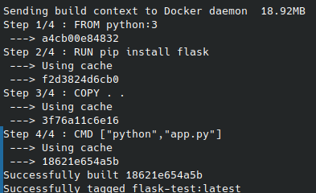
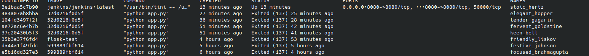

### Steps to setup docker and integrate CI/CD on AWS platform for a flask project


- Create an AWS instance

- A github repository for the flask app

- Push the code on the EC2 instance

- Using ssh open the EC2 instance

- Run the following commands

    ```bash
    sudo apt update
    ```

    ```bash
    sudo apt install python3-venv
    ```

- Create a virtual environment

    ```bash
    python3 -m venv venv
    ```


- Activate the virtual environment

    ```bash
    source venv/bin/activate
    ```

- Install `Docker`

    ```bash
    sudo apt install docker.io
    ```


- Create a Dockerfile

    ```bash
    nano Dockerfile
    ```


- Copy the following code

    ```bash
    FROM python:3
    RUN pip install flask
    COPY . .
    EXPOSE 8000
    CMD ["python", "app.py"]
    ```

- Build the Docker image

    ```bash
    sudo docker build . -t flask-test
    ```

- We get this as the output, where `18621e654a5b` is the image id

    


- To check all running images

    ```bash
    sudo docker ps
    ```


- Make sure to edit inbound rules and add TCP custom with 5000 PORT to anywhere


- Run the docker container

    ```bash
    sudo docker run -p 5000:5000 18621e654a5b
    ```


- Command to stop the container

    ```bash
    sudo docker stop 18621e654a5b
    ```


#### Jenkins setup

- Command to setup jenkins

    ```bash
    sudo docker pull jenkins/jenkins
    ```

- Run Jenkins Docker Container

    ```bash
    sudo docker run -d -p 8080:8080 docker.io/jenkins/jenkins:latest
    ```

- Make sure to edit inbound rules and add TCP custom with 8080 PORT to anywhere

- Open `<ip_address>:8080` in the browser

- In the terminal run the following commands

    ```bash
    sudo docker ps -a
    ```

    - We get something like this

    

    - Look for the name with `IMAGE` as `jenkins/jenkins:latest` like we have here as `stoic_hertz`


- Run the following command to get the password

    ```bash
    sudo docker exec -it stoic_hertz cat /var/jenkins_home/secrets/initialAdminPassword
    ```


- Use the printed password and enter in the jenkins from browser to login


- Now `Install suggested plugins`

- Fill the form for Create First Admin User and in the next page keep jenkins url same

- Now `Setup an agent` in the Dashboard

- Fill the form for the root directory goto the terminal and type 

    ```bash
    pwd
    ```

    And copy paste the output (generally it is `/home/ubuntu`)

- Rest dont click any check boxes

- Now in the jenkins browser jump to the dashboard

- `Create a job`

- Select `Freestyle project` and enter an item name


- Leave all blank and unchecked just jump to `Build Steps` and select `Execute Shell`. In that paste the following

    ```bash
    cd /home/ubuntu/flask-test

    docker ps -q --filter "name=flask-test" | grep -q . && docker stop flask-test && docker rm -f flask-test || true

    docker build . -t flask-test

    docker run -d --name flask-test -p 8000:8000 flask-test

    ```

- In the terminal run these commands

    ```bash
    sudo docker run -d -p 8080:8080 -p 5000:5000 \
    -v /var/run/docker.sock:/var/run/docker.sock \
    -v /home/ubuntu/flask-test:/home/ubuntu/flask-test \
    -v jenkins_home:/var/jenkins_home \
    --name jenkins\
    --user root \
    jenkins/jenkins
    ```

    ```bash
    sudo docker exec -it jenkins bash
    ```

    ```bash
    apt-get update
    ```

    ```bash
    apt-get install -y docker.io
    ```


- Click on save. Jump to `Dashboard/flask-test-dev`. Click `Build Now`


#### Jenkins CI/CD Pipeline with Github integration

- Create a `Personal Access Token` in github from settings -> Developer settings

- Click `repo` and `workflow` options and save

- In Jenkins dashboard go to Manage Jenkins then System

- In this just scroll down to github part and click `Add Github Server`. Add name (GitHub), API URL is same, Credentials add credential. Select `Secret Text`.

- Keep Scope `Global`, Secret as `<Personal Access Token>` and id (jenkins-github-cicd). In the dropdown select the added Credentials and click `Test Connection` to see Github username

- Go to Jenkins Dashboard, create a new job with Freestyle Project

- In the `Source Code Management` select `git`

- Copy the Github repository URL

- Now we can add Credentials here but since we added a global, it is not necessary here

- Select the branch

- Now in the `Build Steps`, Add built step -> Execute Shell

- Paste the following code 

    ```bash
    docker ps -q --filter "name=flask-test" | grep -q . && docker stop flask-test && docker rm -f flask-test || true

    docker build . -t flask-test

    docker run -d --name flask-test -p 8000:8000 flask-test
    ```

#### Docker compose

- Docker-compose setup

    ```bash
    sudo apt install docker-compose
    ```

    ```bash
    docker-compose -v
    ```

- Create a docker-compose file in the project directory

    ```bash
    nano docker-compose.yml
    ```

    ```bash
    version: "3.3"

    services:
        web:
            build: .
            ports:
                - "8000:8000"
    ```


- Start the docker-compose (in the project directory)

    ```bash
    sudo docker-compose up
    ```

- To stop the docker-compose

    ```bash
    sudo docker-compose down
    ```

#### Docker-compose and Jenkins

- In the terminal run these commands

    ```bash
    sudo docker run -d -p 8080:8080 -p 5000:5000 \
    -v /var/run/docker.sock:/var/run/docker.sock \
    -v /home/ubuntu/flask-test:/home/ubuntu/flask-test \
    -v jenkins_home:/var/jenkins_home \
    --name jenkins\
    --user root \
    jenkins/jenkins
    ```

    ```bash
    sudo docker exec -it jenkins bash
    ```

    ```bash
    apt-get update
    ```

    ```bash
    apt-get install -y docker-compose
    ```

- In the jenkins in the Configuration just write

    ```bash
    docker-compose down
    
    docker-compose up -d --force-recreate --no-deps --build web
    ```

- Build the node on jenkins
